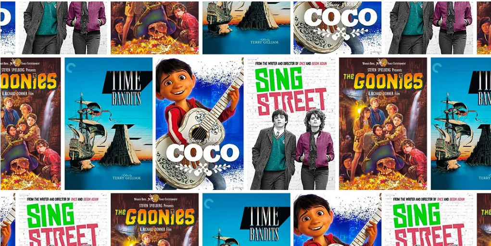

<<<<<<< HEAD
# **Movie Business Launch Analysis & Recommendations**
!(https://www.google.com/url?sa=i&url=https%3A%2F%2Fwww.entrepreneur.com%2Fen-za%2Fstarting-a-business%2Fexamples-of-film-related-business-ideas%2F334938&psig=AOvVaw1QTwvcLTdAAYBMN6huZO9Y&ust=1749469207913000&source=images&cd=vfe&opi=89978449&ved=0CBcQjhxqFwoTCNDD6fHe4Y0DFQAAAAAdAAAAABAL)
=======
![# **Movie Business Launch Analysis & Recommendations**]

>>>>>>> main

**Project Overview**

This project provides data-driven insights to guide a new movie studio's strategy, helping them maximize success in the competitive film industry. By analyzing historical movie performance data, we identify key trends in genres, budgets, release timing, and audience reception to minimize risk and optimize profitability.

**Business Problem**

Entering the film industry as a new studio presents major challenges:
 1. High Investment Risk: Film production requires substantial capital, and a single unsuccessful film can severely impact a new studio's viability.
 2. Lack of Market Insight: Identifying what makes a movie financially successful (e.g., genre, budget, runtime, critical reception, audience popularity) is complex.
 3. Strategic Uncertainty – The studio needs clarity on:

    -  Which movie genres perform best.
    - Optimal budget allocation

    - Best release timing (month/season)

    - Audience preferences (ratings, runtime.)

**Data Understanding**

**Data Source**:  
  The data was sourced from following sources  
  Box Office Mojo (https://www.boxofficemojo.com/ )  
IMDb (https://www.imdb.com/)   
Rotten Tomatoes (https://www.rottentomatoes.com/ )  The Movie DB(https://www.themoviedb.org/)  
The Numbers (https://www.the-numbers.com/ ) containing reviews, ratings,revenue figures and production budgets for various movies released previously.

  **Data Preparation**
  Data was cleaned to remove those without titles since would be impossible to use for any analysis.
<<<<<<< HEAD
=======
  *Title Standardization*: Harmonized movie titles across disparate datasets to enable seamless merging of budget, revenue, and metadata records.

*Temporal Feature Extraction*: Parsed and extracted release month from date fields to uncover seasonal patterns in performance.

*Currency Normalization*: Transformed financial columns into consistent numeric formats, removing symbols and handling scale variations.

*Integrity Filtering*: Dropped rows with null values in mission-critical fields — including production budget, release month, and studio — to preserve dataset reliability and analytical integrity.

The result is a clean, cohesive dataset — engineered to power high-confidence insights and eliminate ambiguity from our strategic decision.

## **Data Preparation, understanding and cleaning**
This is the  critical step to get data that can be easily be used for analysis.They are:
     -Importation of libraries
     -Loading of Data sets 
     -Removing commas and convert to numerics
     -Drop the ones with missing titles
     -Loading of the Database
     -There was also merging of tables with similar data.
     -Create a clean copy and Drop rows with missing values in key columns

## **Visualization and interpretation**

#### Top 10 Genres by Average Rating
The highest rated genre is Game Show, followed by Music, Documentary, and Biography. 
These genres may likely be favored for their entertainment value, emotional impact, and real life relevance.
In contrast, History, Drama, and Adventure received lower average ratings possibly due to slower pacing or predictable storylines.
This shows that people enjoy movies that feel real, emotional, or entertaining more than serious story heavy films

# ROI Top Performers

### Runtime vs. Rating Scatter ploy

Most movies are between 80 to 125minutes long. 
The highest concentration of highly rated movies (7–9 rating) also fall within this runtime range.
There's no strong trend showing that longer movies are rated higher but Very short movies (under 70 min) tend to get lower ratings.
Extremely long movies (over 150 min) are rare and don’t consistently score higher.
Therefore, movies with runtimes between 80–125 minutes tend to be popular and well-rated.
Going too short may risk being seen as underdeveloped, while going too long doesn’t guarantee higher ratings.

### Average Ratings by year

Between 2010 and 2018, average ratings stayed relatively stable, ranging between 6.25 and 6.40
From around 2016, there was a slow rise in ratings and then a sharp spike in 2019. This sharp spike may suggest either improved audience satisfaction or fewer poorly rated films that year. 

***Revenue Insights***

### Total Revenue by Year

There was a steady growth in global revenue from 2010 to 2012 and a sharp decline in 2015 (possibly due to fewer big hit releases).
A Sharp increase in 2016 to 2017 was also witnessed, with peak earnings in 2017 and slight drop in 2018.
This changes show that Movie releases are sensitive to timing, major releases, and global events.
Years with multiple big hit releases (e.g, 2016 to 2017) perform significantly better

### Top Studios by Total Gross

Powerhouse studios like BV (Buena Vista/Disney), Fox, and WB (Warner Bros) dominate in revenue. These studios consistently produce high grossing films which indicates strong distribution networks, popular franchises, and large audiences

### Interpretation of the Visualizations

**Domestic Gross**:
- Most data points cluster near the red line (perfect prediction), indicating decent model fit.
- Outliers suggest variability due to unmodeled factors (e.g., star power, marketing).

**Worldwide Gross**:
- Predictions are more dispersed, indicating less accuracy.
- International performance likely depends on additional market-specific variables.

### Recommendations for the Studio to be set up

1. **Invest in Moderate-to-High Budgets**:
   - Higher budgets generally yield higher returns.
   - Avoid underspending unless the genre favors low-cost production (e.g., horror).

### Return On Investment - ROI
- To achieve maximum capital efficiency, our studio should launch a slate of 3–5 microbudget horror/thriller films annually, targeting $1M budgets and optimizing for ROI.

2. **Optimize Release Timing**:
   - Target popular months (summer and holidays) for major releases.

4. **Supplement Global Strategy with External Insights**:
   - Use global marketing data, localization, and regional audience preferences.

5. **Use Domestic Market as a Testing Ground**:
   - Pilot films domestically before scaling internationally.

6. **Invest in Reality-Based and Musical Genres**
Based on IMDb ratings, Game Shows, Music, Documentaries, and Biographies are the highest-rated genres.
Focus on producing films in these categories to align with current viewer preferences and build credibility.

7. **Aim for a Runtime Between 80–125 Minutes**
Most highly rated films fall within the 80 to 125 minute range, and very short or very long films receive lower ratings.
Targeting this runtime range will balance viewer engagement and satisfaction.
8. **Release Films in Peak Earning Periods & Learn from Top Studios**
The highest movie earnings happened in 2016 and 2017, and studios like Disney (BV) and Warner Bros (WB) made the most money overall. 
Focus on planning movie releases during strong earning years and studying what the top studios did right, like the type of movies they made and when they released them.

# Key Business Takeaways

1. Microbudget Horror Dominates ROI
Low-cost horror/thriller films consistently top ROI charts. Audiences love suspense; production requires less.

2. High ROI ≠ Big Studio
Many of these films were independent or distributed by mid-tier studios, showing room for disruption.

3. Genre + Budget Match Matters
No $150M blockbusters in the list — these were strategic small bets with high payoffs.

>>>>>>> main

